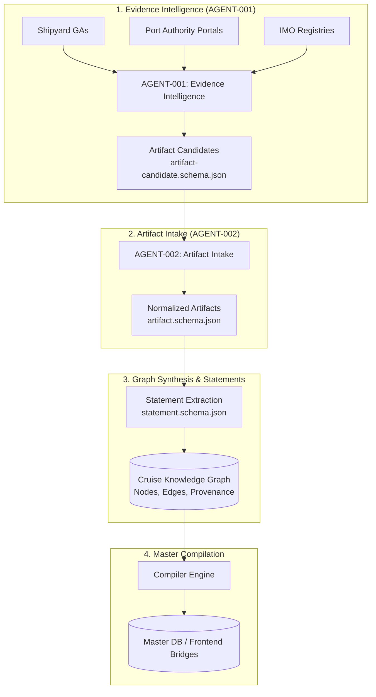

# Knowledge Factory Architecture

> **Deterministic Multi-Stage Acquisition, Schema Enforcement, and Knowledge Graph Compilation.**

---

## 1. Architectural Pipeline

---

## 2. Evidence Classification Hierarchy

Every incoming piece of evidence is graded on a deterministic 4-tier scale:

1. **`OFFICIAL_SHIPYARD` (Weight: 1.00)**: Original general arrangements, builder sea-trial protocols, Chantiers de l'Atlantique / Fincantieri technical dossiers.
2. **`OFFICIAL_AUTHORITY` (Weight: 0.95)**: UN/LOCODE, Port Authority notices, Harbour Master dispatches, Coast Guard declarations.
3. **`OPERATOR_TECHNICAL` (Weight: 0.85)**: Cruise line official deck vector schematics, muster safety plans.
4. **`DECK_OFFICER_LOG` (Weight: 0.80)**: Verified bridge watch logs, empirical gangway deck observations.

---

## 3. Schema Enforcement & Quality Gates

All artifacts must satisfy rigid JSON Schema contracts before passing from Stage 1 (`Candidate`) to Stage 2 (`Ingested Artifact`). Invalid payloads, missing URLs, or non-deterministic coordinates are rejected immediately.
